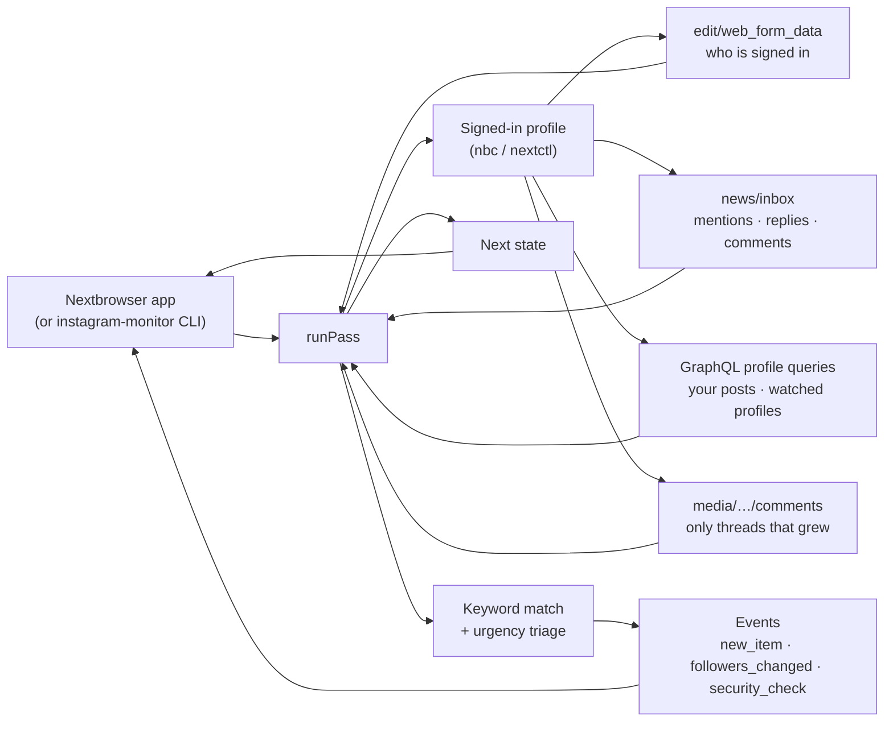

<p align="center">
  
</p>

<h1 align="center">Nextbrowser Instagram Monitoring</h1>

<p align="center">
  <strong>The open-source Instagram monitoring engine for Nextbrowser: comments on your posts, mentions and tags, and new content from the profiles you watch, ranked by how urgently they need an answer, read from your own signed-in browser profile.</strong>
</p>

<p align="center">
  <a href="https://nextbrowser.com/">Website</a> ·
  <a href="https://github.com/nextbrowser-oss/nextbrowser-app">Nextbrowser app</a> ·
  <a href="https://docs.nextbrowser.com/">Product docs</a> ·
  <a href="docs/walkthrough.md">Walkthrough</a> ·
  <a href="docs/how-it-works.md">How it works</a> ·
  <a href="https://discord.com/invite/gHXEvkGXnz">Discord</a>
</p>

<p align="center">
  <a href="https://github.com/nextbrowser-oss/nextbrowser-instagram-monitoring/actions/workflows/ci.yml"></a>
  <a href="LICENSE"></a>
  
  
  <a href="https://github.com/nextbrowser-oss/nextbrowser-app"></a>
</p>

<p align="center">
  English ·
  <a href="docs/i18n/ru/README.md">Русский</a>
</p>

<p align="center">
  
</p>

## Why Nextbrowser Instagram Monitoring

This package is the engine behind Instagram monitoring in [Nextbrowser](https://github.com/nextbrowser-oss/nextbrowser-app). It runs inside the app, on a browser profile you have signed in to instagram.com, and on every pass it answers four questions:

- who mentioned, tagged or replied to the account;
- what people wrote under the account's newest posts;
- what the profiles you watch — competitors, partners — just posted, and which comments under their posts name your keywords;
- which of all that needs an answer first.

It is open source because it works with your own account. Anyone can read exactly which requests it makes, what it keeps from the answers, and how it decides what is urgent.

- **Read-only.** It never likes, comments, replies, or follows. Every request it makes is a `GET`.
- **Comment threads only when they grew.** It remembers each post's comment count and reads a thread again only when the count went up, a few threads per pass at most.
- **No duplicate alerts.** A comment found both in the activity feed and under its post is one item, and an item is announced once, ever.
- **Explainable triage.** Fixed rules rank every match *high*, *medium* or *low*, and each match carries the reasons in plain words. No model is involved and nothing leaves the machine.
- **Says what went wrong.** A signed-out profile, a security check and a rate limit are reported as what they are, not as "nothing new".

## From a comment to an approved reply

Monitoring is one half of the Instagram skill in Nextbrowser. The skill's panel switches between **Monitoring** and **Reply agent**:

| Step | Where | What happens |
| --- | --- | --- |
| 1. Detect mentions and content | this engine | The activity feed (mentions, replies, comments), the comment threads under the account's newest posts, the posts it is tagged in, and the new posts of watched profiles, with the comments under them that name your keywords. |
| 2. Triage by urgency | this engine | Each match is ranked: mentions, tags or replies to you, a comment on your post, an urgent term such as "refund" or "never arrived", a question, a comment nobody answered yet, a watched post picking up fast. |
| 3. Draft a response | Nextbrowser's Instagram reply agent | *Draft reply* hands the match to the connected agent, which opens the post, reads the thread and writes an answer to that specific comment. |
| 4. Approve before publishing | Nextbrowser's Instagram reply agent | The draft is shown to you first. Nothing is posted until you approve it, and then only that reply. |

The engine stops at step 2 on purpose: whatever it finds, a person decides what gets said. The [walkthrough](docs/walkthrough.md) follows one comment through all four steps.

## Key features

| Area | What is available |
| --- | --- |
| Mentions, tags, replies | From the account's activity feed and its tagged posts. A mention in a caption counts as much as one in a comment. Always ranked *high*. |
| Comments on your posts | The threads under the account's 6 newest posts, read only when their comment count grew. A question nobody answered yet is *high*. |
| Watched profiles | Up to 10 profiles: every new post is reported, and with keywords, so are the comments under their newest posts that name one — the place a competitor's customers talk about you. |
| Keywords | Up to 20 words or phrases, matched as whole words in any script. A hashtag or a handle counts as a word: "acme" is found in "#acme" and "@acme". Exclusion words drop the noise. |
| Urgency triage | *high*, *medium* or *low*, with the reasons, from rules you can read in [`src/triage.ts`](src/triage.ts). Urgent terms count only in items about you. |
| Links and context | Every item links straight to the comment (`/p/<post>/c/<comment>/`) or the post, and carries the post it is under, its owner and the caption's opening. |
| Follower counts | The account and every watched profile, with history. |
| Persistent state | One JSON document: starting lines, seen items, per-post comment counts, follower history. Nothing is announced twice across restarts. |
| Degraded states | Signed out, security check, rate limit, a private or missing profile, an endpoint that answers with a page: each one a clear note and a summary flag. |
| Embeddable core | `runPass(state) → { state, events, summary, matches }`, with no Node dependency, so it runs in the Nextbrowser renderer. |
| Standalone CLI | `instagram-monitor` drives any Nextbrowser profile through `nbc`/`nextctl`. |

## Setup

### In Nextbrowser

1. Open **Skills → Instagram → Monitoring**.
2. Choose a browser profile and press **Open instagram.com**. Sign in there yourself; the panel shows `@your_account · Signed in`.
3. Add the profiles to watch (competitors, partners) and your keywords (brand, product names, common misspellings), and words to skip.
4. Pick an interval — 15 minutes or more — and press **Start**.

The first pass draws the starting line and announces nothing, but the panel already lists what is there inside the age window — your posts' comments and keyword comments under watched profiles included — most urgent first, with *Draft reply* on every match. From the second pass on, what is new is marked.

Use a profile with its own proxy, and an account you are prepared to have rate-limited while you tune the settings: Instagram restricts accounts that read faster than a person would.

### In code

Nextbrowser ships the engine as a dependency and gives it the browser, a place to keep the state, and a timer:

```ts
import { normalizeState, runPass, scheduleDelay, withSettings } from "@nextbrowser-oss/instagram-monitoring";

const saved = withSettings(normalizeState(await load()), { profiles: ["rival_store"], keywords: ["acme"] });
const { state, events, summary, matches } = await runPass({
  browser: cliBrowser(profileArgs),          // the app's nextctl-backed browser for the profile
  state: saved,
  onEvent: (event) => notify(event),         // new_item, followers_changed, signed_out, security_check, ...
});
await save(state);
show(matches);                               // most urgent first, with the reasons
const backOff = !!summary.blocked || summary.rateLimited || summary.securityCheck;
setTimeout(next, scheduleDelay(15 * 60_000, { backOff }));
```

The [integration guide](docs/integration.md) describes the contract between the app and the engine.

### Standalone

You need Node.js 22 or later and a Nextbrowser profile signed in to instagram.com. The CLI uses the `nextctl` binary managed by the app, or `nbc` from your `PATH`.

```bash
git clone https://github.com/nextbrowser-oss/nextbrowser-instagram-monitoring.git
cd nextbrowser-instagram-monitoring
npm ci
npm run build
node dist/node/bin.js run --profile <your-profile> --profiles <competitor1>,<competitor2> --keywords "<brand>,<product name>"
```

What to expect:

1. The first pass records every source as its starting line and announces nothing; it still reads the comment threads, so `state` and the app's panel show what is already there.
2. Each later pass prints new matches, most urgent marked `HIGH`, with the reasons and a direct link, then waits about fifteen minutes (`--interval`).
3. Stop it with <kbd>Ctrl</kbd>+<kbd>C</kbd>. The next run continues from the saved state in `~/.nextbrowser/instagram-monitoring/<profile>.json`.

Piped to another program, the output switches to JSON lines, one event per line. The [CLI reference](docs/cli-reference.md) lists every flag.

## Configuration

| Setting | Default | Meaning |
| --- | --- | --- |
| `profiles` | `[]` | Up to 10 profiles to watch, without the `@`. |
| `keywords` | `[]` | Up to 20 words or phrases. |
| `excludeKeywords` | `[]` | Words that drop an item even when a keyword matched. |
| `watchActivity` | `true` | Mentions, replies and comments from the activity feed. |
| `watchOwnComments` | `true` | Comment threads under the account's newest posts. |
| `watchTags` | `true` | Posts the account is tagged in. |
| `watchProfileComments` | `true` | Keyword comments under watched profiles' newest posts. |
| `ownPosts` | `6` | How many of the account's newest posts are watched. |
| `postsPerProfile` | `3` | How many of each watched profile's newest posts are read for keyword comments. |
| `maxCommentReads` | `10` | Comment threads one pass may read; the rest wait for the next pass. |
| `maxItemAgeMs` | 48 h | Older items are not announced. |
| `urgentTerms` | a built-in list | Terms that make an item urgent. |
| `trackFollowers` | `true` | Follower counts and their history. |

[Events and state](docs/events-and-state.md) describes every setting, event and field of the state document.

## How it works



Every pass, in order: it puts the tab on instagram.com and asks who is signed in; reads the account's profile; reads the activity feed; reads the comment threads that grew under the account's posts; reads its tagged posts; reads each watched profile and, with keywords, the threads that grew under their posts; and parks the tab. The [how it works](docs/how-it-works.md) page explains every rule.

## Documentation

- [Walkthrough](docs/walkthrough.md): one comment from detection to an approved reply, step by step.
- [How it works](docs/how-it-works.md): the pass, sources, freshness and deduplication, comment threads, triage, degraded states.
- [Integration guide](docs/integration.md): the contract with the Nextbrowser app, the Node adapter, installing the package.
- [Events and state](docs/events-and-state.md): every event, the state document, and the settings.
- [CLI reference](docs/cli-reference.md): `instagram-monitor` commands, flags, output, and exit codes.
- [Troubleshooting](docs/troubleshooting.md): signed out, security checks, rate limits, private profiles, missing comments.

## Project status

This is an early release (`0.x`). Known limits:

- **Not yet verified live.** Instagram has no public API for any of this: the engine reads the endpoints instagram.com's own web app uses, which answer only a signed-in session and change without notice. A run on 2026-10-02 confirmed that they answer nothing signed out (`401 require_login`); the signed-in answers follow the shapes the web app is known to receive and are covered by tests against stand-ins of those shapes. A signed-in live run is still owed, and the first one will likely need small fixes.
- **No hashtag or keyword search.** Instagram's search is not something a session can read quietly; watch the profiles where the conversation happens instead.
- **The newest comments only.** A thread is read one page deep, the newest comments first; an old post that suddenly draws hundreds of comments is read in part.
- **Counts only.** It tracks how many followers an account has, not who they are.

Proposals and bugs go to [GitHub Issues](https://github.com/nextbrowser-oss/nextbrowser-instagram-monitoring/issues). An issue is a proposal, not a release commitment.

## Contributing

Read [CONTRIBUTING.md](CONTRIBUTING.md) before opening a change. Keep changes focused. For any change to what is read from instagram.com, or to how a match is ranked, include tests. A README change must also update the [Russian edition](docs/i18n/ru/README.md).

## Community and support

- Join the [Nextbrowser Discord](https://discord.com/invite/gHXEvkGXnz) for community chat, setup help, and product updates.
- Ask general questions in [Nextbrowser Discussions](https://github.com/nextbrowser-oss/nextbrowser-app/discussions).
- Use [GitHub Issues](https://github.com/nextbrowser-oss/nextbrowser-instagram-monitoring/issues) for actionable, scoped work.
- Follow [SECURITY.md](SECURITY.md) for private vulnerability reporting. Do not publish security details in an issue.

## Responsible use

Monitor only accounts you own or are authorized to operate, and follow [Instagram's Terms of Use](https://help.instagram.com/581066165581870). The monitor paces itself on purpose:

- at least five minutes between passes, fifteen by default, and three intervals after a refusal, a security check or a rate limit;
- a pause of a few seconds between requests, like a person moving between pages;
- a comment thread is read only when it grew, at most ten per pass;
- caps of 10 watched profiles and 20 keywords.

Do not remove these limits to scrape at scale. Do not use what it finds to post unsolicited or repetitive replies: Instagram restricts accounts for it.

## License

Nextbrowser Instagram Monitoring is open-source software available under the [GNU Affero General Public License v3.0 only](LICENSE).

AGPL-3.0 permits commercial use, modification, and redistribution. If you distribute a modified version or run it as a network service, the license requires you to offer the corresponding source code under the same license. This repository's dependencies remain under their respective licenses.

Copyright © 2026 Nextbrowser contributors.
