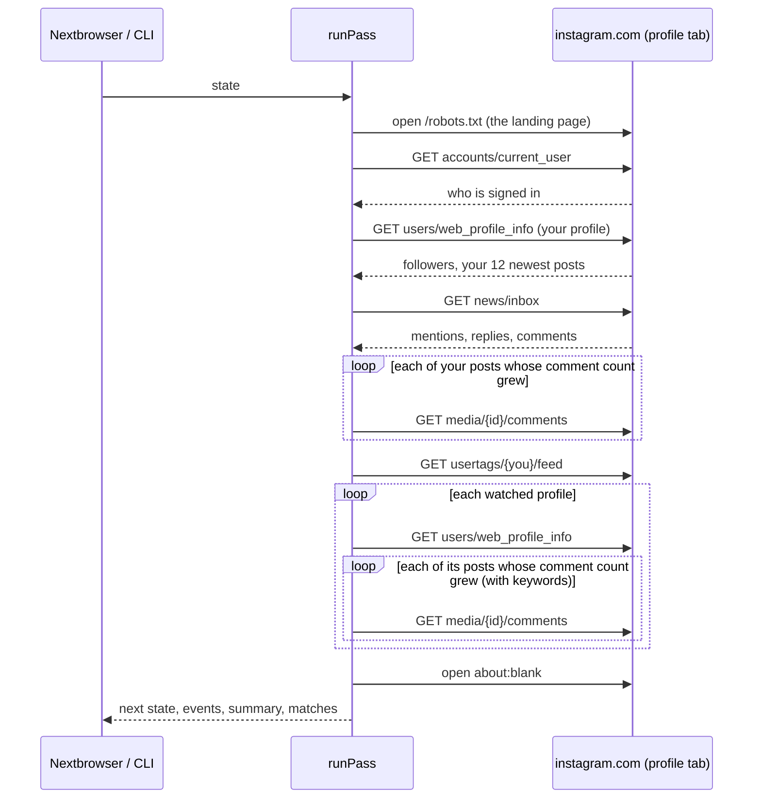

# How it works

A **pass** is one look at Instagram through a Nextbrowser profile that is signed in to instagram.com. It takes the saved state in and returns the next state, the events, a summary, and the matches it found. It never changes the state it was given: a pass that is stopped or fails halfway leaves the last saved state intact, and a pass that finishes returns everything it learned. When the next pass runs is up to the caller.

## Reading instagram.com

instagram.com draws every page from JSON its web app fetches from `/api/v1`. The pass asks the same endpoints from an instagram.com tab, with `fetch`, the profile's cookies, and the headers the web app sends (`X-IG-App-ID`, `X-Requested-With`, and the session's CSRF token). It reads what the signed-in account would see, one small request per read.

The tab lands on `https://www.instagram.com/robots.txt`, the lightest page on the same origin. A tab already on instagram.com is used as it is. Every answer is cut down inside the page to the fields the monitor uses. Media and comment ids are wider than a JavaScript number holds exactly, so the page quotes them before parsing and they stay digit strings everywhere.

Between two requests the pass waits 1.5 to 4 seconds. Instagram restricts accounts that read faster than a person would; the pauses are longer than in the other Nextbrowser monitors on purpose.

**None of these endpoints is a public API.** They answer only a signed-in session, and Instagram changes them without notice. Every read reports what came back — data, the sign-in wall, a security check, a rate limit, a page instead of data — so a change shows up as a clear note, not as silence.

## Sources

| Source | Key | Read from | Reported |
| --- | --- | --- | --- |
| Activity | `activity` | `news/inbox` | Entries with something to answer: a comment on your post, a comment or caption that mentions `@you`, a reply. Likes and follows are left out. |
| Comments on your posts | `comments:own` | `media/{id}/comments` for your newest `ownPosts` posts | Every new comment, except your own. |
| Tags | `tags` | `usertags/{you}/feed` | Every new post you are tagged in. |
| A watched profile's posts | `profile:<handle>:posts` | `users/web_profile_info` | Every new post. |
| Comments under a watched profile's posts | `profile:<handle>:comments` | `media/{id}/comments` for its newest `postsPerProfile` posts | Only comments that name a keyword. Read only when keywords are set. |

An item found by more than one source is reported once, by the first. A comment's key is `comment:<id>` wherever it was found, so a mention read in the activity feed and the same comment read under its post are one item.

## What counts as new

The first time a source is read, what it holds is its **starting line**: the pass records the time and announces nothing. From then on an item is new when:

- the pass has not seen it before (the state keeps the last 5,000 item keys);
- it was created after the source's starting line;
- it is not older than `maxItemAgeMs` (48 hours by default).

A source whose keyword set changes gets a new starting line. A source removed from the settings is forgotten, so adding it back starts over. New items are emitted as `new_item` events, oldest first within each source.

## Comment threads

Reading a thread is the expensive read, so the pass remembers each post's comment count (`state.posts`) and reads a thread only when the count grew:

- A post seen for the first time is only recorded. Its existing comments are part of the starting line.
- A post published after the source started is read as soon as it has comments: all of them are new.
- A pass reads at most `maxCommentReads` threads (10). A post past that keeps its old count, so the next pass sees the growth and reads it — nothing is skipped, only delayed — and the summary says how many wait.
- A thread's count is raised only after what it held was announced. A pass that stops at the next thread — a rate limit, a security check, Stop — leaves it due, and the next pass reads it again.
- A thread is read one page deep, newest comments first.

## Keywords

Keywords are matched against a comment's text or a post's caption as whole words or phrases, case-insensitively, in any script. A hashtag or a handle counts as a word: `acme` is found in `#acme` and `@acme`, not in `acmeshop`. **Exclusion words** drop an item even when a keyword matched, unless the item is addressed to the account.

Keywords filter only the comments under watched profiles' posts. Everything else — your activity, comments on your posts, tags, watched profiles' new posts — is reported anyway; a keyword there only feeds the triage.

## Triage

Every match is ranked by fixed rules. Each adds points and a reason in plain words:

| Rule | Points | Reason shown |
| --- | --- | --- |
| Mentions the account, tags it, or replies to it | +4 | "Mentions you", "Tags you", "Replies to you" |
| Comments on the account's own post | +2 | "Comments on your post" |
| Says an urgent term (`urgentTerms`: "refund", "never arrived", "not working"…), in an item that is addressed to the account or names a keyword | +3 | `Says "never arrived"` |
| Asks a question: a question mark, or text that starts with a question word (leading `@handles` are skipped) | +1 | "Asks a question" |
| A comment on your post that nobody has replied to | +1 | "No reply yet" |
| A watched profile's post under 12 hours old with 50+ comments | +1 | "120 comments in 3 hours" |

Four points or more is **high**, two or three is **medium**, anything else is **low**. A question under your post is high; a plain "love it" under your post is medium; a competitor's sale post is low. No model is involved, and nothing is sent anywhere.

## Degraded states

| What came back | What the pass does |
| --- | --- |
| The sign-in wall (`401` with `require_login`, or a redirect to `/accounts/login`) | Emits `signed_out` once, sets `loginRequired`, and stops: nothing on Instagram can be read signed out. |
| A security check (`checkpoint_required`, `challenge_required`, a `/challenge/` page) | Emits `security_check`, sets `securityCheck`, and stops. Someone has to complete it in the profile. |
| A rate limit (`429`, `feedback_required`, a spam flag) | Sets `rateLimited` and stops. |
| A page instead of data from an endpoint that answers data | Stops with `blocked`: the endpoint changed or closed. |
| No answer within 20 seconds, or a network error | Stops with `blocked`. |
| A watched profile that is private, or does not exist | Notes it and goes on with the next one. |
| A comment thread that fails | Logs it and goes on; the post keeps its old count and is retried. |

After any stop the summary asks for a back-off: `scheduleDelay(interval, { backOff: true })` waits three intervals. A pass that stops keeps everything it read before the stop, and every source it did not reach keeps its old state.

## Parking the tab

Once the reads are done, the pass opens `about:blank`, so nothing is left polling instagram.com between passes. Set `parkTab: false` to keep the page.

## What it never does

The engine only reads. It never likes, comments, replies, follows, or sends a message; every request it makes is a `GET`. It keeps no network connections, timers, or files of its own: everything goes through the browser and the state it is handed.
