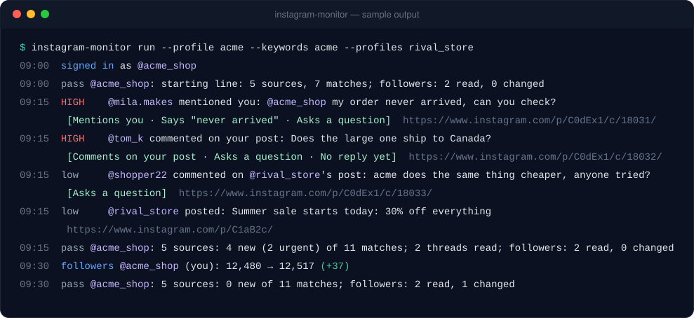
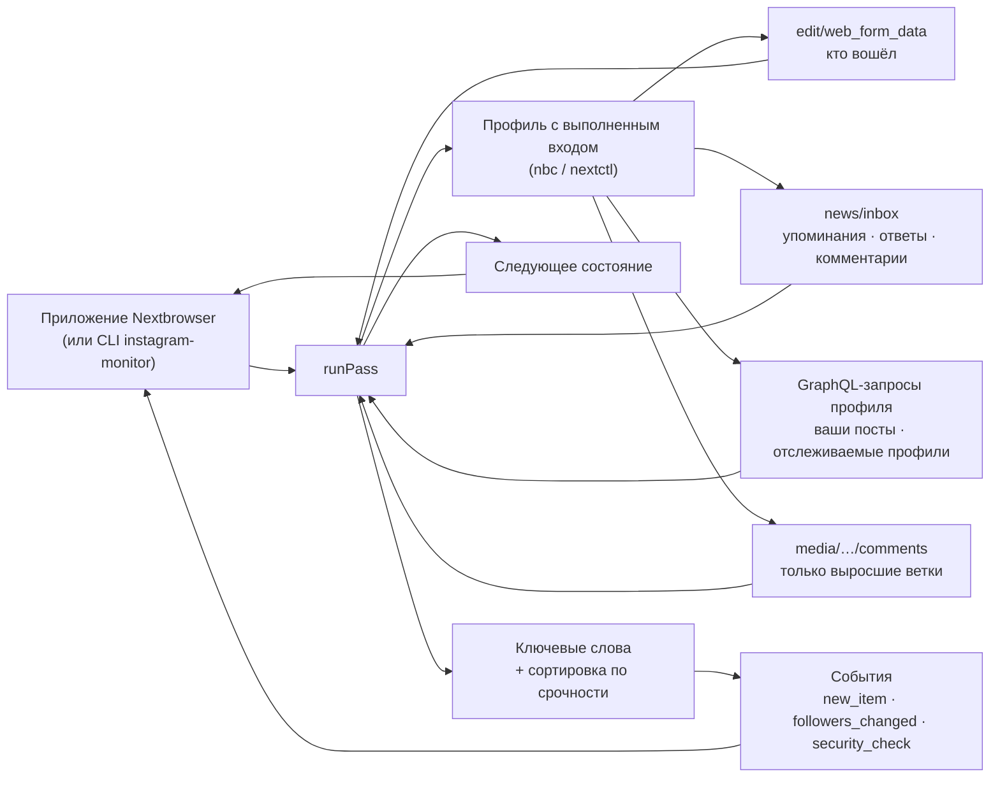

<p align="center">
  
</p>

<h1 align="center">Nextbrowser Instagram Monitoring</h1>

<p align="center">
  <strong>Открытый движок мониторинга Instagram для Nextbrowser: комментарии под вашими постами, упоминания и отметки, новые публикации профилей, за которыми вы следите, — отсортированные по срочности ответа и прочитанные из вашего браузерного профиля, в котором выполнен вход.</strong>
</p>

<p align="center">
  <a href="https://nextbrowser.com/">Сайт</a> ·
  <a href="https://github.com/nextbrowser-oss/nextbrowser-app">Приложение Nextbrowser</a> ·
  <a href="https://docs.nextbrowser.com/">Документация продукта</a> ·
  <a href="../../walkthrough.md">Пошаговый разбор</a> ·
  <a href="../../how-it-works.md">Как это работает</a> ·
  <a href="https://discord.com/invite/gHXEvkGXnz">Discord</a>
</p>

<p align="center">
  <a href="https://github.com/nextbrowser-oss/nextbrowser-instagram-monitoring/actions/workflows/ci.yml"></a>
  <a href="../../../LICENSE"></a>
  
  
  <a href="https://github.com/nextbrowser-oss/nextbrowser-app"></a>
</p>

<p align="center">
  <a href="../../../README.md">English</a> ·
  Русский
</p>

<p align="center">
  
</p>

## Зачем нужен Nextbrowser Instagram Monitoring

Этот пакет — движок мониторинга Instagram в [Nextbrowser](https://github.com/nextbrowser-oss/nextbrowser-app). Он работает внутри приложения, в браузерном профиле, где вы вошли в instagram.com, и за каждый проход отвечает на четыре вопроса:

- кто упомянул аккаунт, отметил его или ответил ему;
- что написали под последними постами аккаунта;
- что опубликовали профили, за которыми вы следите (конкуренты, партнёры), и какие комментарии под их постами называют ваши ключевые слова;
- на что из этого ответить в первую очередь.

Код открыт, потому что движок работает с вашим собственным аккаунтом. Любой может прочитать, какие запросы он делает, что сохраняет из ответов и как решает, что срочно.

- **Только чтение.** Никаких лайков, комментариев, ответов и подписок. Каждый запрос — `GET`.
- **Ветки комментариев — только когда выросли.** Движок помнит число комментариев у каждого поста и перечитывает ветку, только когда оно выросло, — не больше нескольких веток за проход.
- **Без повторных уведомлений.** Комментарий, найденный и в активности, и под постом, — один элемент, и сообщается о нём один раз.
- **Объяснимая сортировка.** Фиксированные правила ставят каждому совпадению *high*, *medium* или *low*, с причинами обычными словами. Никакой модели, и ничего не уходит с машины.
- **Говорит, что пошло не так.** Выход из аккаунта, проверка безопасности и лимит запросов называются своими именами, а не выглядят как «ничего нового».

## От комментария до одобренного ответа

Мониторинг — половина Instagram-скилла в Nextbrowser. Панель скилла переключается между **Monitoring** и **Reply agent**:

| Шаг | Где | Что происходит |
| --- | --- | --- |
| 1. Найти упоминания и контент | этот движок | Лента активности (упоминания, ответы, комментарии), ветки комментариев под последними постами аккаунта, посты, где он отмечен, новые посты отслеживаемых профилей и комментарии под ними с вашими ключевыми словами. |
| 2. Отсортировать по срочности | этот движок | Каждое совпадение получает ранг: упоминание, отметка или ответ вам, комментарий под вашим постом, срочное слово вроде «refund» или «never arrived», вопрос, комментарий без ответа, быстро набирающий обороты пост. |
| 3. Написать черновик | Instagram reply agent в Nextbrowser | *Draft reply* отдаёт совпадение подключённому агенту: он открывает пост, читает ветку и пишет ответ именно на этот комментарий. |
| 4. Одобрить перед публикацией | Instagram reply agent в Nextbrowser | Черновик сначала показывается вам. Ничего не публикуется без вашего одобрения, и тогда — только этот ответ. |

Движок намеренно останавливается на шаге 2: что бы он ни нашёл, что сказать в ответ, решает человек. [Пошаговый разбор](../../walkthrough.md) проводит один комментарий через все четыре шага.

## Основные возможности

| Область | Что доступно |
| --- | --- |
| Упоминания, отметки, ответы | Из ленты активности аккаунта и постов, где он отмечен. Упоминание в подписи считается так же, как в комментарии. Всегда *high*. |
| Комментарии под вашими постами | Ветки под 6 последними постами аккаунта, только когда число комментариев выросло. Вопрос без ответа — *high*. |
| Отслеживаемые профили | До 10 профилей: каждый новый пост, а при заданных ключевых словах — и комментарии под их последними постами, где слово названо: там, где клиенты конкурента говорят о вас. |
| Ключевые слова | До 20 слов или фраз, целыми словами в любом алфавите. Хэштег и ник считаются словом: «acme» находится в «#acme» и «@acme». Слова-исключения отсекают шум. |
| Сортировка по срочности | *high*, *medium* или *low* с причинами, по правилам из [`src/triage.ts`](../../../src/triage.ts). Срочные слова учитываются только в том, что касается вас. |
| Ссылки и контекст | Каждый элемент ведёт прямо на комментарий (`/p/<post>/c/<comment>/`) или пост и несёт пост, под которым он написан, его владельца и начало подписи. |
| Подписчики | Аккаунт и каждый отслеживаемый профиль, с историей. |
| Состояние между запусками | Один JSON-документ: стартовые линии, увиденное, число комментариев у постов, история подписчиков. Ничего не сообщается дважды, даже после перезапуска. |
| Ошибки и деградация | Выход из аккаунта, проверка безопасности, лимит, приватный или несуществующий профиль, эндпоинт, ответивший страницей: у каждого своё сообщение и флаг в итоге прохода. |
| Встраиваемое ядро | `runPass(state) → { state, events, summary, matches }` без зависимости от Node — работает в рендерере Nextbrowser. |
| Отдельный CLI | `instagram-monitor` управляет любым профилем Nextbrowser через `nbc`/`nextctl`. |

## Настройка

### В Nextbrowser

1. Откройте **Skills → Instagram → Monitoring**.
2. Выберите браузерный профиль и нажмите **Open instagram.com**. Войдите там сами; панель покажет `@your_account · Signed in`.
3. Добавьте профили для отслеживания (конкуренты, партнёры), ключевые слова (бренд, названия продуктов, частые опечатки) и слова-исключения.
4. Выберите интервал — 15 минут или больше — и нажмите **Start**.

Первый проход проводит стартовую линию и ни о чём не сообщает; со второго панель показывает, что требует внимания, срочное сверху, с кнопкой *Draft reply* у каждого совпадения.

Используйте профиль со своим прокси и аккаунт, который не жалко временно упереть в лимит, пока вы подбираете настройки: Instagram ограничивает аккаунты, которые читают быстрее человека.

### В коде

Nextbrowser поставляет движок как зависимость и даёт ему браузер, место для состояния и таймер:

```ts
import { normalizeState, runPass, scheduleDelay, withSettings } from "@nextbrowser-oss/instagram-monitoring";

const saved = withSettings(normalizeState(await load()), { profiles: ["rival_store"], keywords: ["acme"] });
const { state, events, summary, matches } = await runPass({
  browser: cliBrowser(profileArgs),          // the app's nextctl-backed browser for the profile
  state: saved,
  onEvent: (event) => notify(event),         // new_item, followers_changed, signed_out, security_check, ...
});
await save(state);
show(matches);                               // most urgent first, with the reasons
const backOff = !!summary.blocked || summary.rateLimited || summary.securityCheck;
setTimeout(next, scheduleDelay(15 * 60_000, { backOff }));
```

Контракт между приложением и движком описан в [руководстве по интеграции](../../integration.md).

### Отдельно

Нужны Node.js 22 или новее и профиль Nextbrowser, в котором выполнен вход в instagram.com. CLI использует `nextctl`, которым управляет приложение, или `nbc` из `PATH`.

```bash
git clone https://github.com/nextbrowser-oss/nextbrowser-instagram-monitoring.git
cd nextbrowser-instagram-monitoring
npm ci
npm run build
node dist/node/bin.js run --profile <your-profile> --profiles <competitor1>,<competitor2> --keywords "<brand>,<product name>"
```

Чего ожидать:

1. Первый проход записывает каждый источник как стартовую линию и ни о чём не сообщает.
2. Каждый следующий печатает новые совпадения — срочные с пометкой `HIGH`, с причинами и прямой ссылкой — и ждёт около пятнадцати минут (`--interval`).
3. Остановите <kbd>Ctrl</kbd>+<kbd>C</kbd>. Следующий запуск продолжит с состояния в `~/.nextbrowser/instagram-monitoring/<profile>.json`.

Если направить вывод в другую программу, он переключается на JSON Lines. Все флаги — в [справочнике CLI](../../cli-reference.md).

## Конфигурация

| Настройка | По умолчанию | Значение |
| --- | --- | --- |
| `profiles` | `[]` | До 10 профилей для отслеживания, без `@`. |
| `keywords` | `[]` | До 20 слов или фраз. |
| `excludeKeywords` | `[]` | Слова, отбрасывающие элемент, даже если ключевое слово нашлось. |
| `watchActivity` | `true` | Упоминания, ответы и комментарии из ленты активности. |
| `watchOwnComments` | `true` | Ветки комментариев под последними постами аккаунта. |
| `watchTags` | `true` | Посты, где отмечен аккаунт. |
| `watchProfileComments` | `true` | Комментарии с ключевыми словами под постами отслеживаемых профилей. |
| `ownPosts` | `6` | Сколько последних постов аккаунта отслеживать. |
| `postsPerProfile` | `3` | Сколько последних постов каждого профиля читать на ключевые слова. |
| `maxCommentReads` | `10` | Сколько веток можно прочитать за проход; остальные ждут следующего. |
| `maxItemAgeMs` | 48 ч | О более старом не сообщается. |
| `urgentTerms` | встроенный список | Слова, делающие элемент срочным. |
| `trackFollowers` | `true` | Число подписчиков и его история. |

Все настройки, события и поля состояния описаны в [событиях и состоянии](../../events-and-state.md).

## Как это работает



Каждый проход по порядку: открывает instagram.com во вкладке и спрашивает, кто вошёл; читает профиль аккаунта; читает ленту активности; читает выросшие ветки под постами аккаунта; читает посты, где он отмечен; читает каждый отслеживаемый профиль и, при ключевых словах, выросшие ветки под его постами; паркует вкладку. Все правила — на странице [«Как это работает»](../../how-it-works.md).

## Документация

- [Пошаговый разбор](../../walkthrough.md): один комментарий от обнаружения до одобренного ответа.
- [Как это работает](../../how-it-works.md): проход, источники, новизна и дедупликация, ветки комментариев, сортировка, деградация.
- [Руководство по интеграции](../../integration.md): контракт с приложением Nextbrowser, Node-адаптер, установка.
- [События и состояние](../../events-and-state.md): все события, документ состояния и настройки.
- [Справочник CLI](../../cli-reference.md): команды, флаги, вывод и коды выхода `instagram-monitor`.
- [Решение проблем](../../troubleshooting.md): выход из аккаунта, проверки безопасности, лимиты, приватные профили, пропавшие комментарии.

## Статус проекта

Это ранний выпуск (`0.x`). Известные ограничения:

- **Ещё не проверен вживую.** У Instagram нет публичного API для всего этого: движок читает эндпоинты, которыми пользуется само веб-приложение instagram.com; они отвечают только сессии с выполненным входом и меняются без предупреждения. Прогон 2026-10-02 подтвердил, что без входа они не отдают ничего (`401 require_login`); ответы с входом следуют известной форме и покрыты тестами на подставных данных. Живой прогон с входом ещё предстоит, и первый, скорее всего, потребует мелких правок.
- **Нет поиска по хэштегам и ключевым словам.** Поиск Instagram не то, что сессия может читать незаметно; отслеживайте профили, где идёт разговор.
- **Только новые комментарии.** Ветка читается на одну страницу, новые сначала; у старого поста, внезапно собравшего сотни комментариев, прочитается часть.
- **Только счётчики.** Сколько подписчиков у аккаунта — да, кто они — нет.

Предложения и баги — в [GitHub Issues](https://github.com/nextbrowser-oss/nextbrowser-instagram-monitoring/issues). Issue — это предложение, а не обязательство выпустить.

## Участие в разработке

Прочитайте [CONTRIBUTING.md](../../../CONTRIBUTING.md) перед изменением. Любое изменение того, что читается с instagram.com, или того, как ранжируется совпадение, должно сопровождаться тестами. Изменение README обновляет и [русскую версию](README.md).

## Сообщество и поддержка

- [Discord Nextbrowser](https://discord.com/invite/gHXEvkGXnz): общение, помощь с настройкой, новости.
- Общие вопросы — в [Nextbrowser Discussions](https://github.com/nextbrowser-oss/nextbrowser-app/discussions).
- [GitHub Issues](https://github.com/nextbrowser-oss/nextbrowser-instagram-monitoring/issues) — для конкретной работы.
- Об уязвимостях — приватно по [SECURITY.md](../../../SECURITY.md).

## Ответственное использование

Отслеживайте только аккаунты, которыми вы владеете или управлять которыми вам разрешено, и соблюдайте [Условия использования Instagram](https://help.instagram.com/581066165581870). Монитор намеренно соблюдает темп:

- не меньше пяти минут между проходами, пятнадцать по умолчанию, и три интервала после отказа, проверки безопасности или лимита;
- пауза в несколько секунд между запросами, как у человека, переходящего между страницами;
- ветка комментариев читается только когда выросла, не больше десяти за проход;
- не больше 10 отслеживаемых профилей и 20 ключевых слов.

Не снимайте эти ограничения ради массового сбора данных. Не используйте найденное для непрошеных или однотипных ответов: Instagram ограничивает за это аккаунты.

## Лицензия

Nextbrowser Instagram Monitoring — открытое ПО под лицензией [GNU Affero General Public License v3.0 only](../../../LICENSE).

AGPL-3.0 разрешает коммерческое использование, изменение и распространение. Если вы распространяете изменённую версию или запускаете её как сетевой сервис, лицензия требует предоставить исходный код на тех же условиях. Зависимости репозитория остаются под своими лицензиями.

Copyright © 2026 Nextbrowser contributors.
